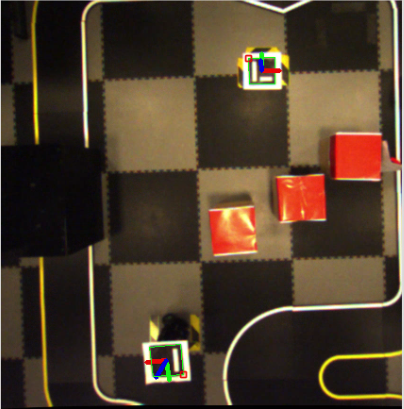
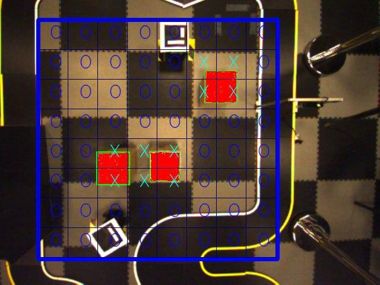
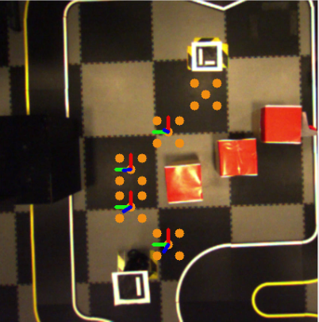
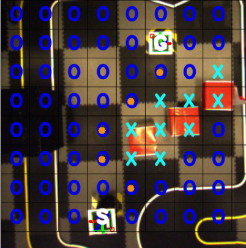

# Visual Servoing Project
## Introduction
The purpose of this project is to implement an end to end visual sevoing project using a fish-eye camera and a Turtlubot3 with ROS. 
1. The first objective is to move the robot from the current position to the target position. To specify those positions and their poses we use two Aruco markers. 
2. The second task for the robot is to avoid obstacles that are specified using red color, we implemented this task using A-star path finding algorithm.
3. Finally, when the robot is at the target position we have to do "parking", that means that the targets position pose should be the same as the robot's pose.

Following on this report we will analyse the mathematical theoritical background and the code implementation we implemented.

## What is ROS?
The Robot Operating System (ROS) is an open source middleware which contains a set of libraries,softwares and tools that are used to facilitate the development of robotic applications. There is a plethora of features from sensor drivers to state-of-the-art algorithms. As middleware, it contains characteristics of both software and hardware, hencee, it is able to perform various actions like hardware abstraction and low level control.
Until now, different version of ROS exists with some crusial differences, so for compatibility reasons we are using the Melodic release.

## Robot used for this scenario
### Turtlebot Description
For the project, the mobile robot used is a Turtlebot3 Burger. The Turtlebot3 is a compact, modular and programmable mobile robot. It uses ROS and it is able to create multiple application for training research and development.

# First Objective - Move from current to target position

## 1. Camera Calibraton 
This is a crusial step for the fisheye camera which is integrated to Turtlebot3. The implementation uses the [camera_calibration](http://wiki.ros.org/camera_calibration) package from ROS. This packages uses OpenCV camera calibration, fully described [here](https://docs.opencv.org/2.4/modules/calib3d/doc/camera_calibration_and_3d_reconstruction.html). For this step we only have to use the checkerboard in order to get all the related coefficients for the undistortion.  

## 2. Receive image
The next step is to receive image frames by subscribing to the ROS topic "/camera/image_raw" and convert it to numpy array. Then we need to crop the image according to our needs, by specifing the window that we need to work on. Afterwards we undistord the received image using the camera matrix and the distortion coefficients received on the previous step.

## 3. Detect Markers
Using the OpenCV library we can detect two Aruco markers that are placed on the top of the robot, one marker for the current and one for the target position. We only have to call the function `cv2.detectMarkers` from wich we receive the corners of each marker and we can move on to the pose estimation.

## 4. Pose estimation
 Next step is to estimate the current and target poses, simple by calling the function `cv2.estimatePoseSingleMarkers` in the [pose estimation module](https://github.com/manoskout/visual_servoing/blob/master/scripts/pose_estimation.py). From which we receive two vectors for each marker, one translational vector [x, y, z] and one rotational vector [x, y, z]. Using the ROS publisher we sent those vectors to the robot controller, who is responsible to translate those matrices in a way that the robot should be able to move. This is implemented with the ROS publisher `rospy.Publisher('current_position', Pose_estimation_vectors, queue_size=10)`, where the *current_position* is the ROS topic that the controller will subscribe to fetch the custom message *Pose_estimation_vectors* tha we created, in order to send those vectors.

The structure of this message is the following:          
`geometry_msgs/Vector3 rotational`  
`geometry_msgs/Vector3 translational`

Here is the image with both of the poses:

## 5. Controller - Convert rotational and translational matrices to homogenious matrices
The [controller module](https://github.com/manoskout/visual_servoing/blob/master/scripts/controller.py) have to convert the rotational vector into rotational matrix using the Rodrigues transformation with the OpenCV function:   
` rotational_matrix, _ = cv2.Rodrigues(np.array([data.rotational.x, data.rotational.y, data.rotational.z], dtype=np.float32))`.  

Then we stack the rotational matrix horizontally with the transformational vector and append at the end the row *[0, 0, 0, 1]* in order to receive the homogenious matrix. 

## 6. Calculate the angle and distance between current and target positions
We multiply the inverse of the current homogenious matrix with the target homogenious matrix to receive the desired homogenious matrix (t):  
`t = np.matmul(np.linalg.inv(self.curr_homogenious_matrix), self.target_homogenious_matrix)`

Following, we need to calculate the angle (beta) and the distance (rho) that the robot should move:  

We get the dx, dy from the t matrix:  
`dx = t[0][3]`
`dy = t[1][3]`

Then we calculate the arctan using dx, dy:  
`self.beta = math.atan2(dy, dx)`

And finally we get the distance to target (rho) by applying the Euclidean distance:  
`self.rho = math.sqrt(math.pow(dy, 2) + math.pow(dx, 2))`

## 7. Fix the angle and move the robot to target
Now we fix the beta angle by publishing to the ROS topic `cmd_vel` only angular velocity, and when the angle is correct according to the target angle we publish again to the same topic only linear velocity until the distance to target is near to zero. We use a proportional controller, so the velocities that are given to the robot are multiplied by two constants, one for angular and one for linear velocity.

# Second Objective - Avoid obstacles
## 1. Obstacle detection
The [obstacle detection module](https://github.com/manoskout/visual_servoing/blob/master/scripts/obstacle_detection.py) is using the input image and slice it into boxes of size equal to the robot size. This way we have an array with all the possible moves that the robot can achive. To distinguish the obstacles, that mean if there is an obstacle -a red box- in the image the robot should not be able to move there. 

Then we iterate for every box of the image and convert the box to HSV. Next we mask the image if the box contains any pixels in the range of red color, and apply the bitwise mask to the output. If the box contains red pixels we assume that it is an obstacle.

The output of this step is an one directional array with lenght equals to the number of the boxes wich contains zero's (when there is no obstacle) and one's (where there is an obstacle).

## 3. Find shortest path using A-star Algorithm
Using the obstacles map array of the previous step we implement the [Path planning module](https://github.com/manoskout/visual_servoing/blob/master/scripts/path_planning.py) to receive the shortest path the robot should move to go into the target faster. 

This is a graph based algorithm which is using an heuristic method for better performance. The core of this is f = g + h, where:
- F is the total cost  
- G is the distance between the current node and the start node.  
- H is the heuristic — estimated distance from the current node to the end node.

Read the following [article](https://medium.com/@nicholas.w.swift/easy-a-star-pathfinding-7e6689c7f7b2) for more informations.

## 4. Middle-point pose
Shortest path contains some middlepoints that the robot should move to find the target position faster without any collision with the obstacles. 

Here, we face a problem because we only have the indexes of those middlepoints. So, we decided to convert those indexes to pixels according to our boxed frame. Using their corners we calculate their poses the same way we calculate the pose for the aruco markers with the function: `cv2.aruco.estimatePoseSingleMarkers`.   

## 4. Draw shortest path
Then, we itterate throught the obstacles map and draw on the image each middle point of the shortest path we calculated in the previous steps.

This is the final map, where blue zeros specify that there is a valid movement for the robot, light blue X specify there is an obstacle, orange circles specify the shortest path, bold white S and G specify the starting and goal point of the path respectively.

## 5. Move on each middle point

# Third Objective - Parking
## 1. Calculate Euler angle
## 2. Move the robot to fix the angle error
